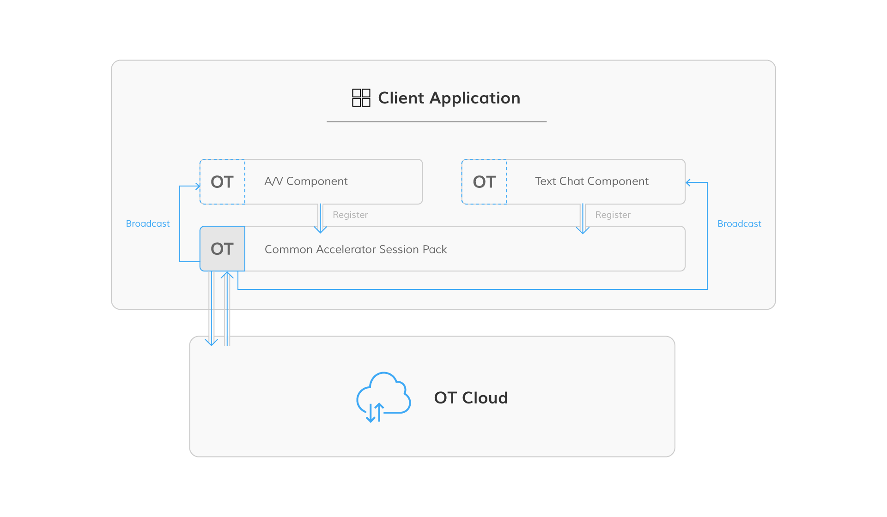

# iOS SDK Wrapper and Common Accelerator Pack 

## Quick start

This section shows you how to prepare and use the iOS SDK Wrapper and the Accelerator Pack as part of an application.

## Add the library

To get up and running quickly with your development, go through the following steps using CocoaPods:

1. Add the following line to your pod file: ` pod 'OTAccPackUtil'  `
2. In a terminal prompt, navigate into your project directory and type `pod install`.
3. Reopen your project using the new `*.xcworkspace` file.

For more information about CocoaPods, including installation instructions, visit [CocoaPods Getting Started](https://guides.cocoapods.org/using/getting-started.html#getting-started).

## Common Accelerator Pack

The Common Accelerator Pack is required whenever you use any of the OpenTok accelerators. It includes the Common Accelerator Session Pack, which is a common layer that includes the audio-video communication logic contained in all [OpenTok One-to-One Communication Sample Apps](https://github.com/opentok/one-to-one-sample-apps), and permits all accelerators and samples to share the same OpenTok session. The accelerator packs and sample app access the OpenTok session through the Common Accelerator Session Pack layer, which allows them to share a single OpenTok session:



## SDK Wrapper

For detail about the APIs used to develop this wrapper, see the [OpenTok iOS SDK Reference](https://tokbox.com/developer/sdks/ios/reference/) and [iOS API Reference](http://developer.android.com/reference/packages.html).

### Using the iOS SDK Wrapper

#### Init the SDK Wrapper

```ios

	OTSDKWrapper *wrapper = [[OTSDKWrapper alloc] initWithDataSource:self];
    
```

```ios

	//set OTWrapperSignalDelegate: signaling listener
	self.wrapper.delegate = self;

```

#### Connect and disconnect from an OpenTok session

Call to connect or disconnect from an OpenTok session. 

To handle the different callbacks from the SDK-Wrapper, it offers a Block.

Eg: When the OTWrapper is connected, a new block's signal, named 'OTWrapperDidConnect' is called.
If the OTWrapper failed to connect, the 'OTWrapperDidFail' signal is called.

```ios
	
	 __weak TestSDKWrapperViewController *weakSelf = self;
    
    [self.wrapper connectWithHandler:^(OTWrapperSignal signal, NSString *streamId, NSError *error) {
        __strong TestSDKWrapperViewController *strongSelf = weakSelf;
        if(strongSelf) {
            if (!error) {
                //....
            }
            else {
                NSLog(@"Error: %@", error.description);
            }
        }
    }];

    [self.wrapper disconnect];

```

#### Start and stop preview

Call to start and stop displaying the camera's video in the Preview's view before it starts streaming video. Therefore, the other participants are not going to receive this video stream.
New signals's block are called: OTWrapperDidStartCaptureMedia and OTWrapperDidStopCaptureMedia


```ios
	 
	UIView *localView = [self.wrapper captureLocalMedia];
              
```              

#### Start and stop publishing media

Call to start and stop the local streaming video. The source of the stream can be the camera.
New signals's block are called: OTWrapperDidStartPublishing and OTWrapperDidStopPublishing

```ios
	
	//start publishing
    UIView * pubView = [self.wrapper startPublishingLocalMedia];
       
    	if (pubView != nil) {
        	pubView.frame = self.publisherView.bounds;
            [self.publisherView addSubview:pubView];
        }

        //...
		
		[self.wrapper stopPublishingLocalMedia];
```

